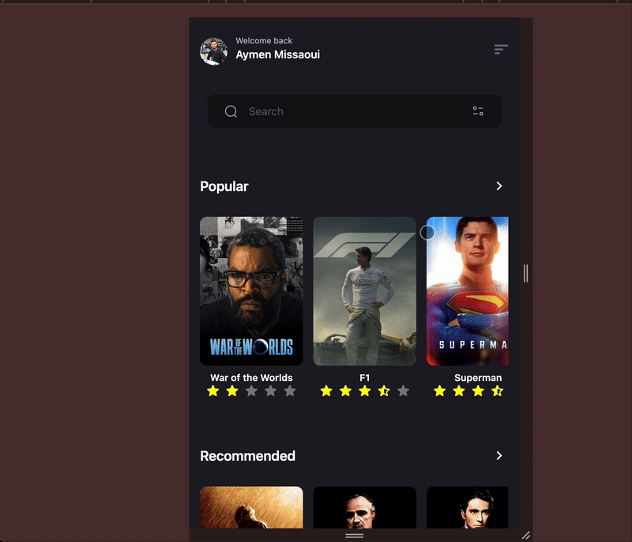

# 🎬 The Movie App

A movie browsing application built with **SvelteKit** and **Tailwind CSS**, based on the provided Figma design.  
The app fetches data dynamically from **The Movie Database (TMDb) API**.

---

## 🚀 Features
- Pixel-perfect UI based on Figma design
- **Home screen** with two sections:
    - Popular (carousel of movies/TV shows)
    - Recommended (carousel of movies/TV shows)
- **Filters**:
    - Filter by genre (multi-select)
    - Filter by release year
- **Search** movies
- **Details page** with:
    - Poster
    - Title
    - Description
    - Release date
    - Rating
- Fully responsive design

---

## 🛠️ Tech Stack
- [SvelteKit](https://kit.svelte.dev/)
- [Tailwind CSS](https://tailwindcss.com/)
- [TMDb API](https://www.themoviedb.org/documentation/api)

---

## 📦 Installation & Setup

1. **Clone the repository**
   ```bash
   git clone https://github.com/your-username/movie-app.git
   cd movie-app
2. **Install dependencies**
   ```bash
   npm install
   Configure environment variables
3. **Create a .env file in the root with your TMDb API key:**
   ```bash
    PUBLIC_TMDB_API_KEY=your_api_key_here
Get your API key from TMDb API
4. **Get your API key from TMDb API**
.

Run the development server
# 🎬 The Movie App

A movie browsing application built with **SvelteKit** and **Tailwind CSS**, based on the provided Figma design.  
The app fetches data dynamically from **The Movie Database (TMDb) API**.

---

## 🚀 Features
- Pixel-perfect UI based on Figma mobile design
- Extended support for **tablet and desktop** breakpoints
- **Home screen** with two sections:
    - Popular (carousel of movies/TV shows)
    - Recommended (carousel of movies/TV shows)
- **Filters**:
    - Filter by genre
    - Filter by release year
- **Search** movies
- **Details page** with:
    - Poster
    - Title
    - Description
    - Release date
    - Rating
- Fully responsive design

---

## 📱💻 UI & Responsiveness
- The provided Figma design included **mobile UI only**.
- This app was built **pixel-perfect** according to that mobile design.
- In addition, **tablet and desktop breakpoints** were implemented to ensure the app is fully responsive across all devices.
- Layouts, spacing, and typography were carefully adjusted to scale smoothly on larger screens while staying true to the original design language.

---

## 🛠️ Tech Stack
- [SvelteKit](https://kit.svelte.dev/)
- [Tailwind CSS](https://tailwindcss.com/)
- [TMDb API](https://www.themoviedb.org/documentation/api)

---

## 📦 Installation & Setup

1. **Clone the repository**
   ```bash
   git clone https://github.com/your-username/movie-app.git
   cd movie-app


2. **Install dependencies**
   ```bash
   npm install

3. **Configure environment variables**
   ```bash
    PUBLIC_TMDB_API_KEY=your_api_key_here

💡 Note: You can get your API key from the [An Internal Link](https://www.themoviedb.org/settings/api)

4. **Run the development server**
   ```bash
    npm run dev
5. **Open http://localhost:5173
   in your browser.**

## 🔨 Build & Preview

To create a production build and preview it locally:

    ```bash
    npm run build
    npm run preview
---

## 🌐 Live Demo
The app is deployed on Vercel:  
👉 [Movie App on Vercel](https://movie-app-blue-tau.vercel.app/)

---

## 🚀 Deployment

[](https://movie-app-blue-tau.vercel.app/)

The app is live on **Vercel**:  
👉 [https://movie-app-blue-tau.vercel.app/](https://movie-app-blue-tau.vercel.app/)


## 📹 Demo



